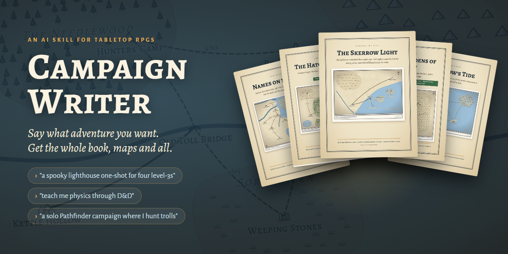
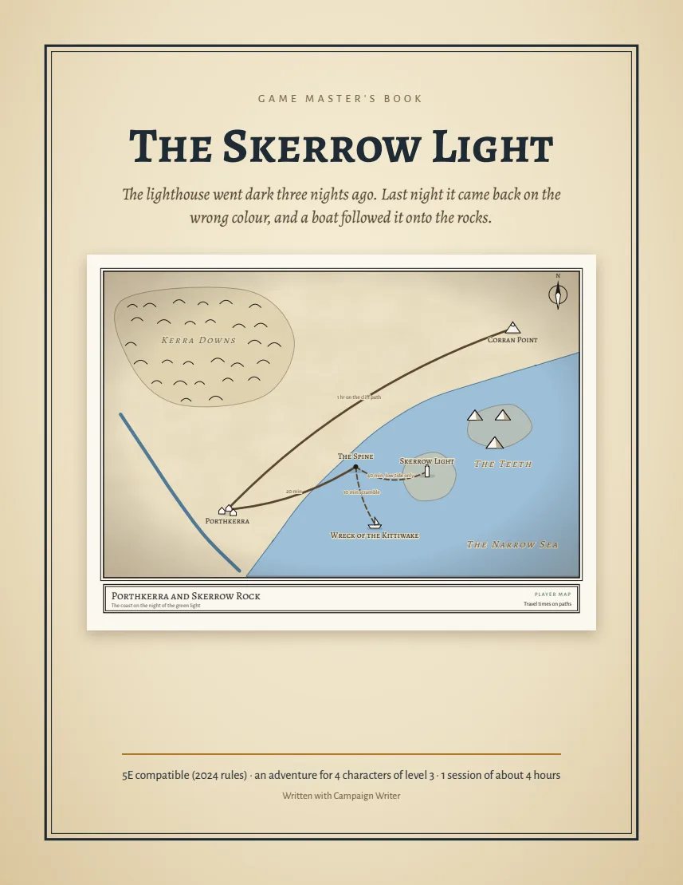
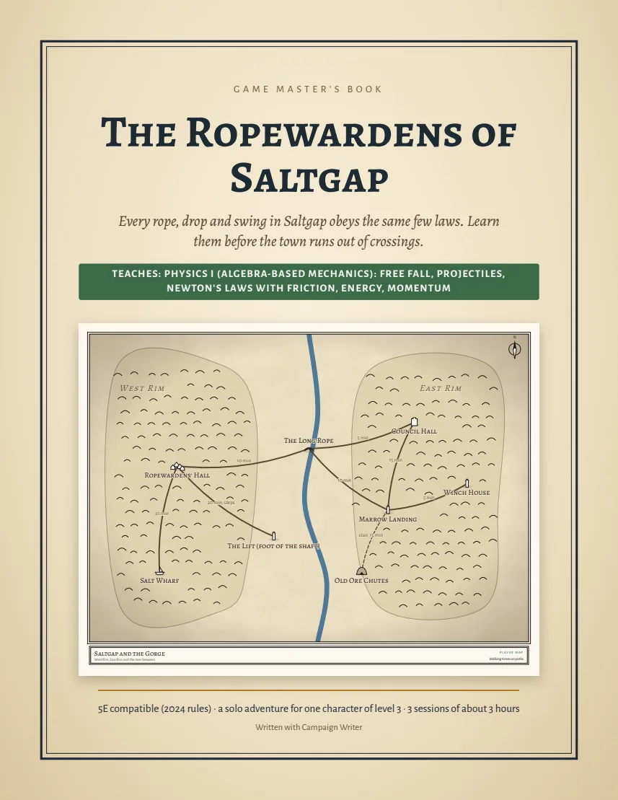
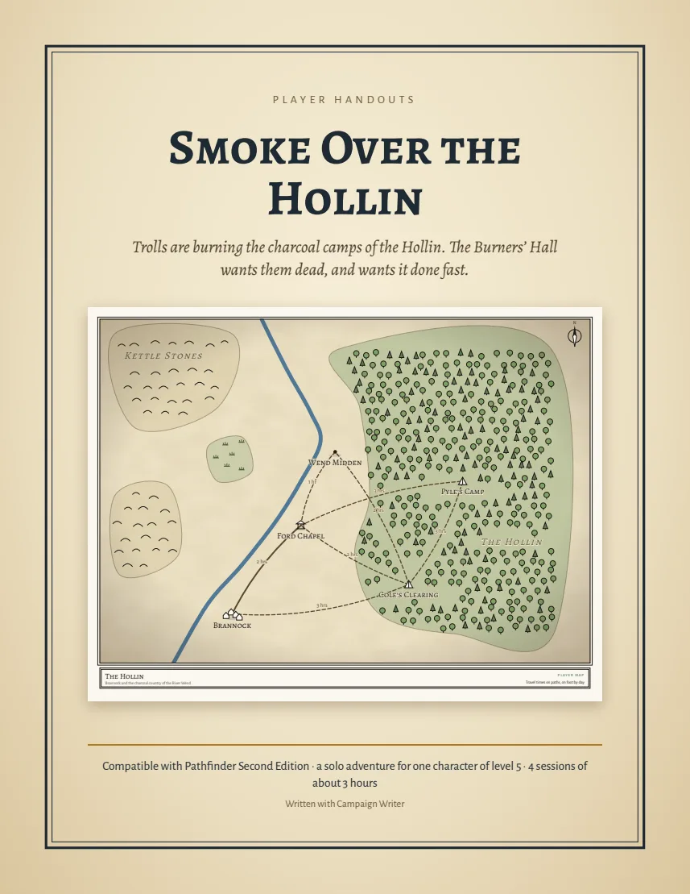
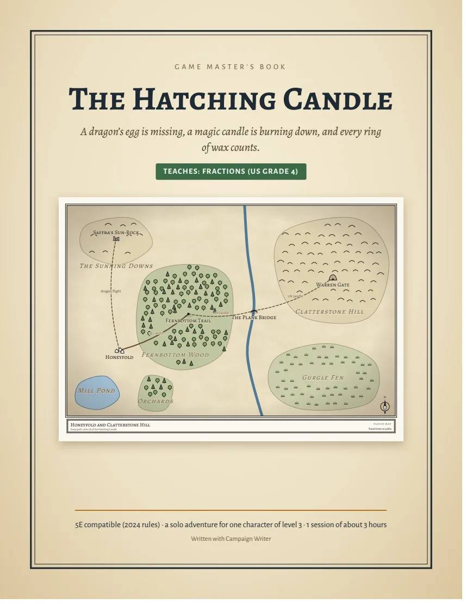
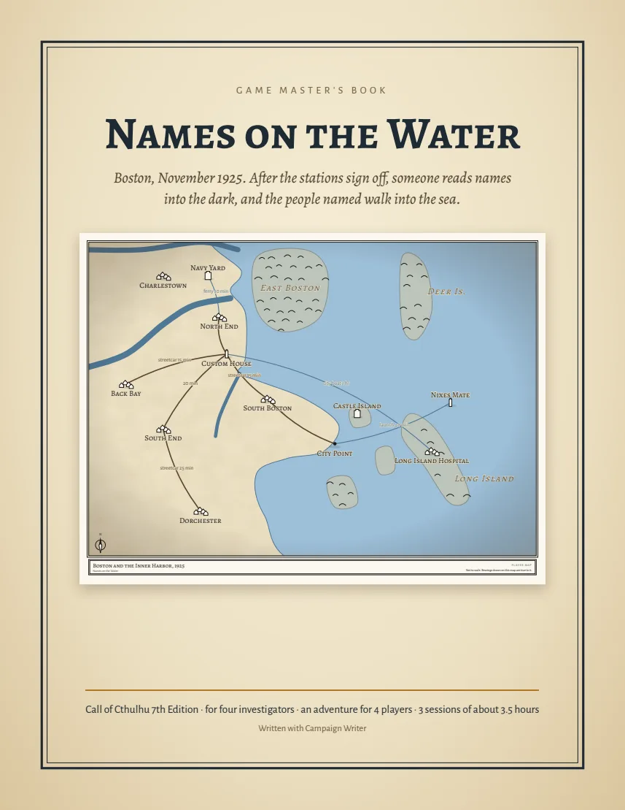
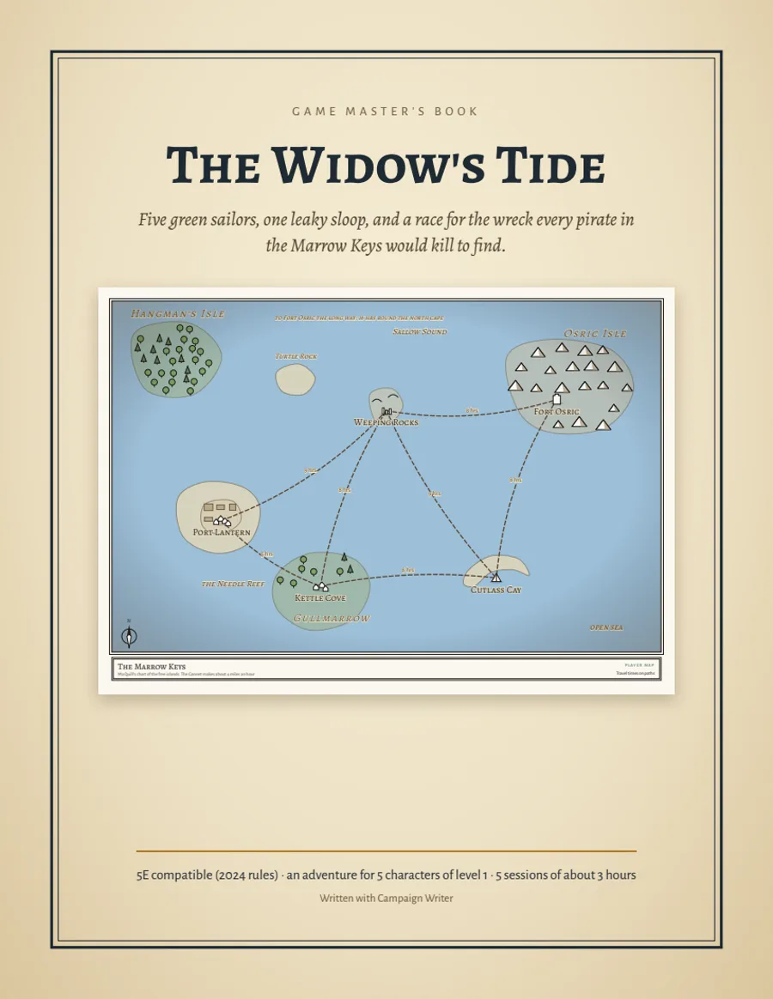
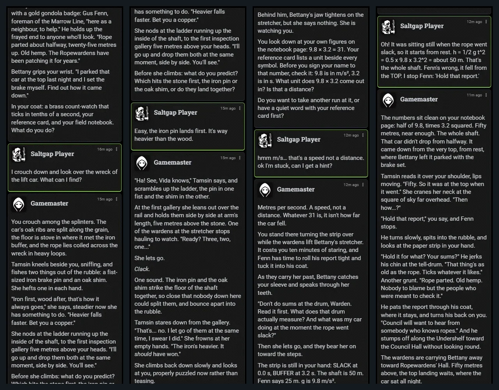
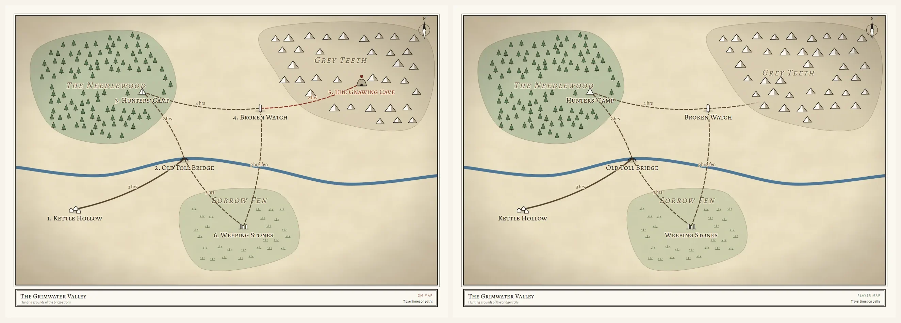
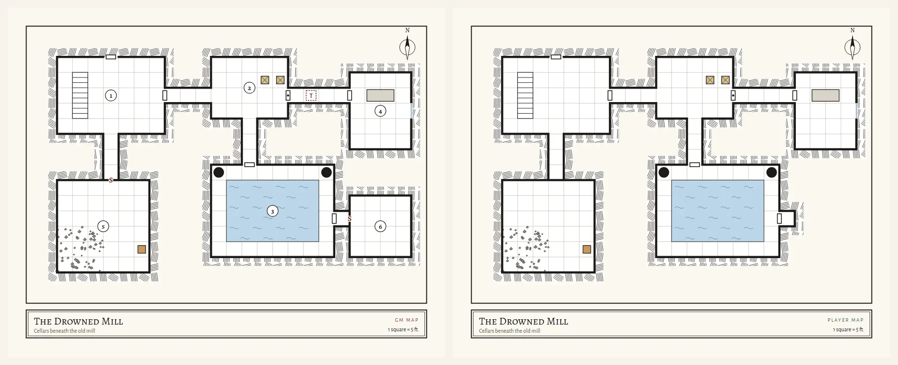

<p align="center">
  
</p>

<p align="center">
  <a href="https://github.com/cha1latte/campaign-writer/releases/latest"></a>
  <a href="#-grab-a-free-adventure"></a>
  
  
</p>

<h3 align="center">Your next adventure is one sentence away.</h3>

**Campaign Writer** is a skill for your AI assistant (Claude Code, Codex and friends). Tell it what you're in the mood for and it writes the kind of adventure you'd buy from a store: a **GM book PDF**, **maps** for print and your VTT, **player handouts**, **ready-to-play characters**, and fights balanced with your game's own rules. Ask it to **teach** something and the lesson becomes the gameplay.

> *"a spooky one-shot for my group this Friday, haunted lighthouse maybe"* → **The Skerrow Light**, 29 pages, five maps, four pregens, a tide that cuts off the causeway, and a lamp that burns green.

## ✨ Ask for anything

<table>
<tr>
<td width="33%" align="center"><br><sub><i>"a spooky one-shot… haunted lighthouse"</i><br><b>D&D 5e · 4 players · one night</b></sub></td>
<td width="33%" align="center"><br><sub><i>"teach me physics I but through dnd"</i><br><b>Teach mode · solo · 3 sessions</b></sub></td>
<td width="33%" align="center"><br><sub><i>"a solo pathfinder campaign where i hunt trolls"</i><br><b>Pathfinder 2e · solo · 4 sessions</b></sub></td>
</tr>
<tr>
<td align="center"><br><sub><i>"teach my 10 year old fractions? she loves dragons"</i><br><b>Teach mode · kids · one afternoon</b></sub></td>
<td align="center"><br><sub><i>"call of cthulhu… 1920s boston… roll20"</i><br><b>Call of Cthulhu 7e · 4 investigators · 3 sessions</b></sub></td>
<td align="center"><br><sub><i>"pirate campaign… 5 brand new level 1s… owlbear rodeo"</i><br><b>D&D 5e · level 1 → 4 · 5 sessions</b></sub></td>
</tr>
</table>

Every one of these was written from that single sentence by a fresh AI that had nothing but this skill.

## 🎁 Grab a free adventure

Four of them are yours to play right now, with GM book, handouts, maps and VTT files in each zip:

| Adventure | For | Download |
|---|---|---|
| **The Skerrow Light**: the lighthouse went dark, then burned green | D&D 5e, 4 × level 3, one session | [zip](https://github.com/cha1latte/campaign-writer/releases/latest/download/example-the-skerrow-light.zip) |
| **The Hatching Candle**: a stolen dragon's egg, a candle that burns down in eighths | D&D 5e for kids, Teach mode, one session | [zip](https://github.com/cha1latte/campaign-writer/releases/latest/download/example-the-hatching-candle.zip) |
| **Names on the Water**: a 3 a.m. radio show reads out the names of the next to drown | Call of Cthulhu 7e, 4 investigators, 3 sessions | [zip](https://github.com/cha1latte/campaign-writer/releases/latest/download/example-names-on-the-water.zip) |
| **The Widow's Tide**: race a pirate legend to a lost treasure galleon | D&D 5e, 5 players, level 1 → 4, 4–5 sessions | [zip](https://github.com/cha1latte/campaign-writer/releases/latest/download/example-the-widows-tide.zip) |

## 📦 What's in the box

```text
📕 GM book (PDF)         overview, every location keyed, NPCs with voices and secrets, stat blocks, endings
📗 Player handouts       the pitch, reference cards, pregenerated characters, player maps
📙 Found in play         letters, logs and notices the GM hands over when the players find them
🗺️  Maps                 GM version · player version · VTT image · Foundry walls · Universal VTT (.dd2vtt)
⚖️  Balanced fights      encounter budgets from your game's own rules, checked by a script
🦉 Foundry hand-off      ready-made journal pages for Familiar's AI game master
```

## 🎓 Teach mode: learn by playing

Ask it to teach and the subject *is* the game. You learn free fall by timing the lift that fell, fractions by keeping a magic candle from burning out, momentum by stopping a runaway ore cart. You won't answer a quiz to open a door.

<p align="center"></p>
<p align="center"><sub>Played live in Foundry with an AI game master: predict, watch what really happens, explain, get <b>one</b> hint when stuck, and solve it yourself.</sub></p>

- **Predict, then watch.** Your companion bets on the classic wrong idea; you commit to a guess; the world shows the truth.
- **Hints in three rungs**, each with a small cost in the story. Dice can buy a hint, never the answer.
- **Answers recomputed by script**, facts traced to real sources (OpenStax and friends).
- **A Learning Guide** a parent or tutor can run: worked solutions, common wrong answers, debrief questions.

## 🗺️ Maps worth printing

No AI art. The maps are drawn from the adventure itself, so the map and the book always agree, and every map comes in a version that's **safe to show your players**:

<p align="center"></p>
<p align="center"><sub>GM version (left) and player version (right): the hidden lair is gone, with no tell-tale gap in the mountains. The road just fades into the unknown.</sub></p>
<p align="center"></p>
<p align="center"><sub>Keys, secret doors, traps and hidden rooms for the GM; clean walls for the table. Drop the VTT version into Foundry, Roll20, Owlbear Rodeo or Fantasy Grounds.</sub></p>

## 🙈 Playing it yourself? No spoilers

Say *"I'll be playing it"*, or just ask for something you'll play solo. Your assistant keeps the villain, the twist, the clues and the answers **out of the chat** and out of everything you're meant to open. It tells you which files are GM-only, and a checker scans your handouts and maps for spoilers before you ever see them.

Pair it with an AI game master and you can play the whole thing without ever seeing the book.

## 🦉 Plays in Foundry with Familiar

With [Familiar](https://familiarvtt.com) and its companion skill [Familiar Campaign Prep](https://github.com/cha1latte/familiar-campaign-prep), your assistant installs the adventure in Foundry VTT: journals, scenes, walls and your AI game master's instructions. Then *"hi, let's play"* is all it takes. Teach mode gives the AI GM extra rules so it asks, waits and hints instead of solving the puzzle for you.

## ⚡ Install (2 minutes)

1. **[Download the latest `campaign-writer.zip`](https://github.com/cha1latte/campaign-writer/releases/latest)** and unzip it.
2. Put the `campaign-writer` folder where your assistant loads skills:

   | Assistant | Folder |
   |---|---|
   | Claude Code | `~/.claude/skills/campaign-writer/` |
   | Codex | `~/.codex/skills/campaign-writer/` |
   | Anything else | Anywhere it can read; then say *"follow campaign-writer/SKILL.md"* |

   Or hand your assistant the zip and say *"install this skill"*.
3. You need **Python 3.9+** (nothing to pip install). PDFs and map images use Chrome, Edge, Chromium or Brave if you have one. So the assistant can look over its own pages: `pip install pypdfium2 pillow`.

Then ask for an adventure. That's it.

## 🎲 Works with

| Games | Virtual tabletops |
|---|---|
| **D&D 5e** (2024 and 2014 rules) · **Pathfinder 2e** (remaster) · **Call of Cthulhu 7e** · guidance for OSR games, Powered by the Apocalypse, Blades in the Dark and more | **Foundry VTT** (walls and doors included) · **Roll20** · **Owlbear Rodeo** · **Fantasy Grounds** · or print it and play at the kitchen table |

Rules material from open licences (SRD 5.2.1 under CC-BY, Pathfinder under ORC) is credited the way those licences require, and the checker makes sure the notice is there.

## 🧪 Tested for real

- **Six full campaigns** were written cold by fresh AIs given only this skill, across three game systems. After each round, everything they stumbled on was fixed.
- **Every rules number** (encounter budgets, CR and XP, DCs, creature levels) was checked against SRD 5.2.1 and Archives of Nethys, not memory.
- **Played live in Foundry** by two different AI game masters (an outside Claude and Familiar's own), running Teach mode the way it's meant to go.
- **A built-in checker** catches dead ends, missing clues, unfair fights, wrong puzzle answers, spoilers in player handouts and missing licence notices before you see the book.

## Good to know

- **Fresh and yours.** Every adventure is written new for you. Nothing is copied from published adventures.
- **No AI art.** Lots of players dislike it, and it would spend your credits. Ask if you want some anyway.
- **It writes, it doesn't run.** For an AI game master, pair it with Familiar Campaign Prep, or hand the GM book to a friend.
- **Not playtested by humans yet.** If you run one, tell us how it went!

## License

[MIT](LICENSE). Fonts: Alegreya, Alegreya SC and Alegreya Sans by Huerta Tipográfica (SIL Open Font License 1.1). Made by Chai, the same person behind [Familiar Campaign Prep](https://github.com/cha1latte/familiar-campaign-prep). Issues, pull requests and table stories welcome.
